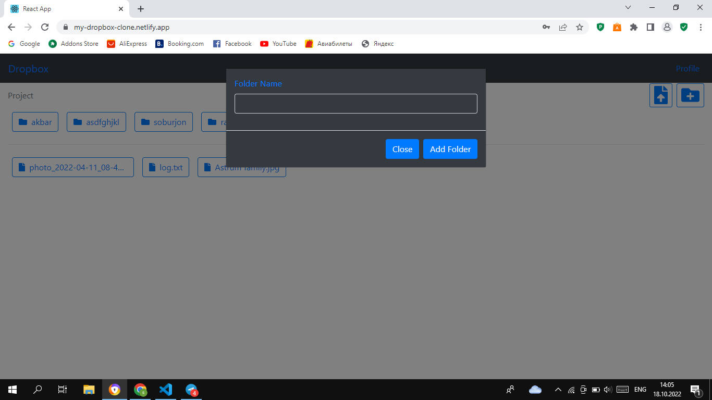

# Welcome Dropbox

<h3>Welcome to my project <a href="https://my-dropbox-clone.netlify.app/">Dropbox</a></h3>

## Authors

- [@Soburjon19](https://www.github.com/Soburjon19)
- [@Akbarjon03](https://www.github.com/Akbarjon03)
- [@KhRavshanDev](https://www.github.com/KhRavshanDev)

## Demo

https://my-dropbox-clone.netlify.app

## 🔗 Links
Soburjon Daminov

Akbar Odilov

Ravshan Khakimov

# Abilities 
<ul>
<li>Auth</li>
<li>Create Folder</li>
<li>Create File</li>
<li>Upload Files</li>
<li>View Profile</li>
<li>Edit Profile</li>
</ul>

# Dropbox images

